# 掌尚北国小程序逆向

假设你已经能通过fiddler/charles或者其他抓包软件抓取到接口地址以及参数，并能通过逆向拿到小程序代码.

## 1. MD5 sign加密

**1.1 点击小程序，在抓包软件可以发现每个接口都会有sign和time/timestamp参数, 可以发现首页url https://wxapp.ruyigou.com/index.php/shop/getMyMiniProgram 接口的参数是最少的，所以可以从该接口入手**
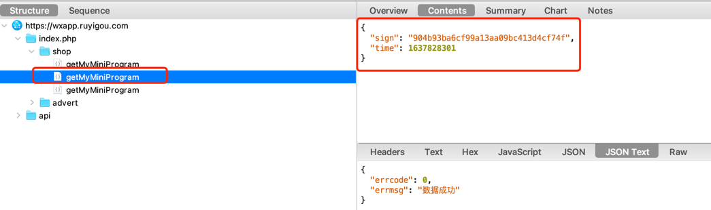

**1.2 在vs code或者其他ide上面全局搜索接口关键字: getMyMiniProgram, 然后可以发现 index.js 里面是 url: xxx，其他的都是字符串的拼接；**

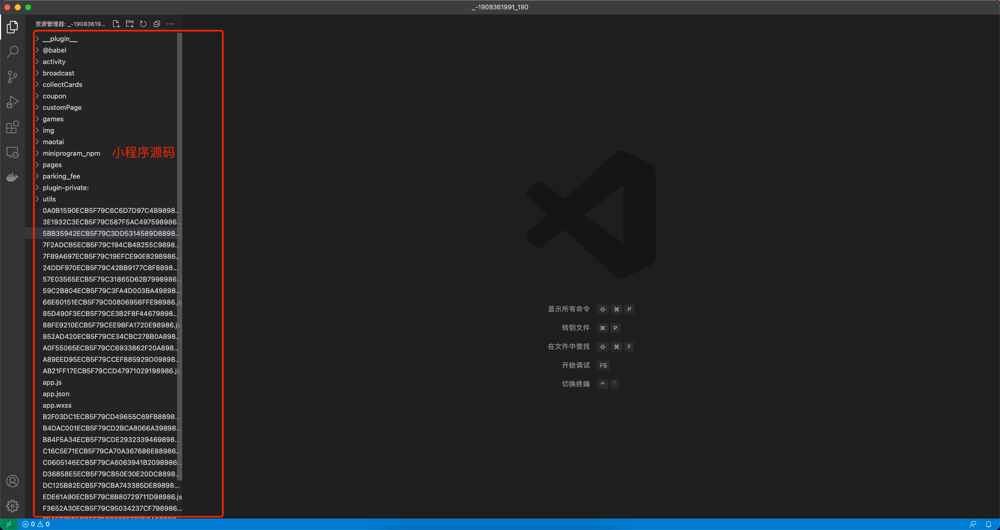
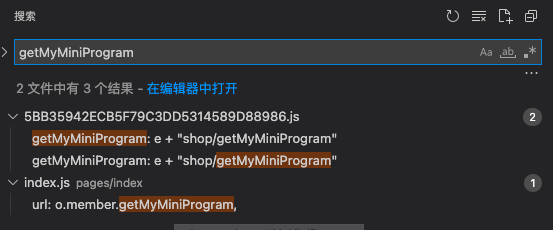

**1.3 找到接口请求的代码后，点击(index.js)进去；可以看到接口请求的参数是 i和a；**

a(time) : 是当前时间戳，除以 1e3就是不要时间戳的 毫秒(ms)
i(sign) : l.hex_md5 可以看出来是使用了md5方法进行加密(暂时不考虑md5方法是否被修改过), 加密的字符串是 a+apisecret; a是时间戳，所以只要全局搜索:apisecret找到秘钥即可
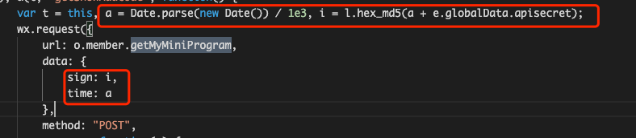
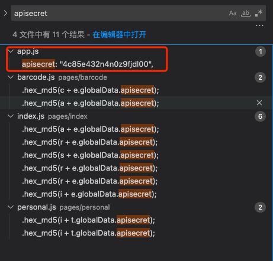

**1.4 解密(先不考虑md5方法被修改,直接先尝试用md5进行加密sign进行对比)**

以下是python代码模拟加密, 可以判断sign跟接口sign一样，直接md5方法即可; 或者在线md5也可以: https://www.cmd5.com/
```python

import time
from hashlib import md5

# 接口请求的参数
params = {
    "sign": "904b93ba6cf99a13aa09bc413d4cf74f",
    "time": 1637828301
}
# 获取时间戳,后面可以动态获取，当前只做校验
a = params['time']
# 秘钥
apisecret = '4c85e432n4n0z9fjdl00'
# 加密的字符串
enc_str = str(a) + apisecret

print(md5(enc_str.encode()).hexdigest() == params['sign'])

```

## 2. nonce_str生成以及 sign值生成
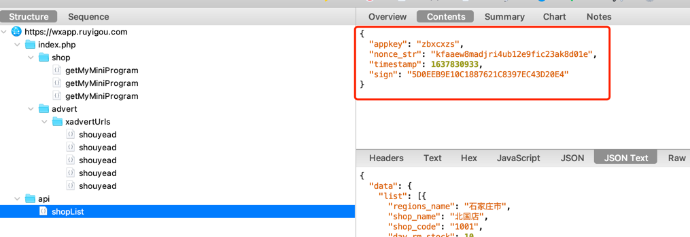
**2.1 同理全局搜索 nonce_str，并找到关键代码的位置, n是引用了其他的js文件，所以直接通过js名称获取到生成str的代码；看到生成nonce_str的代码，arguments的长度为空时，循环次数为32, 看代码和nonce_str可以推测该方法只是随机生成一个32位的字符串**
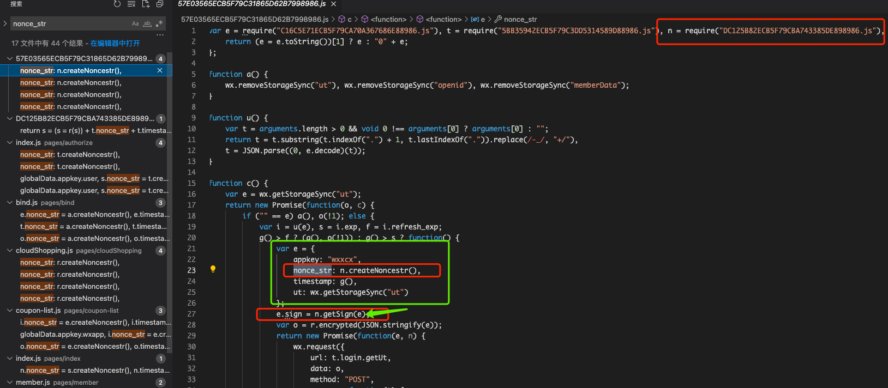
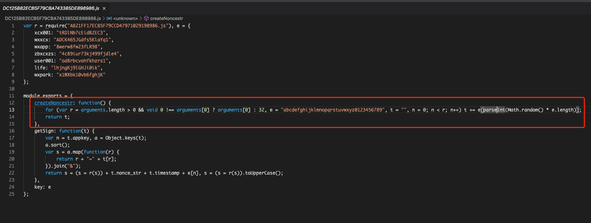
**2.2 模拟生成nonce_str方法**
```python
import random
def get_nonce_str(length=32):
    _chose_map = 'abcdefghijklmnopqrstuvwxyz0123456789'
    return ''.join([random.choice(_chose_map) for i in range(length)])
```

**2.3 在搜索nonce_str的时候，发现有个代码如下, e是一个object且传递到getSign方法得出sign值，并赋值给e；跟nonce_str一样找到 getSign方法**
```javascript
                var e = {
                    appkey: "wxxcx",
                    nonce_str: n.createNoncestr(),
                    timestamp: g(),
                    ut: wx.getStorageSync("ut")
                };
                e.sign = n.getSign(e);
```
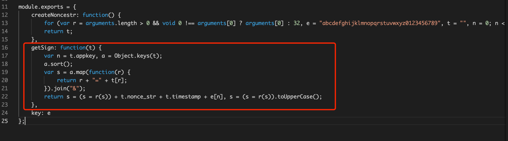

** 2.4 在vs code不好定位到这个方法怎么执行，可以打开微信开发者工具，用游客模式编译小程序即可；第一次可能会有 app.json/xxx_pluginxx.js错误编译失败，删除那些依赖的js文件重新编译就行**

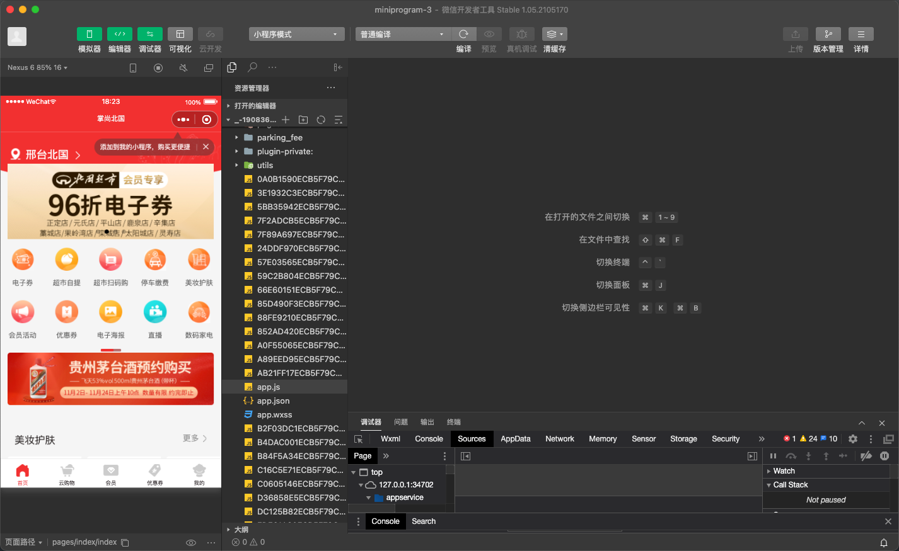

** 2.5 搜索getSign方法，并在关键的地方打上断点 ** 

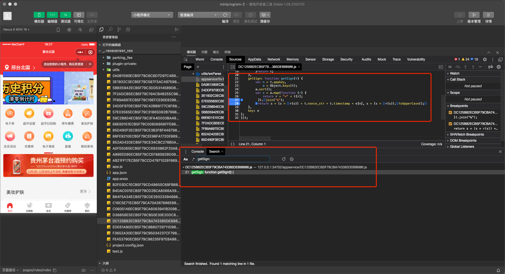

** 2.6 打上断点后，点击重新编译，这时候可以看到传递进来的参数t和加密的字符串s; 因为两处都有r(s)，使用r方法进行加密，所以根据断点，继续进去方法内断点调试 ** 
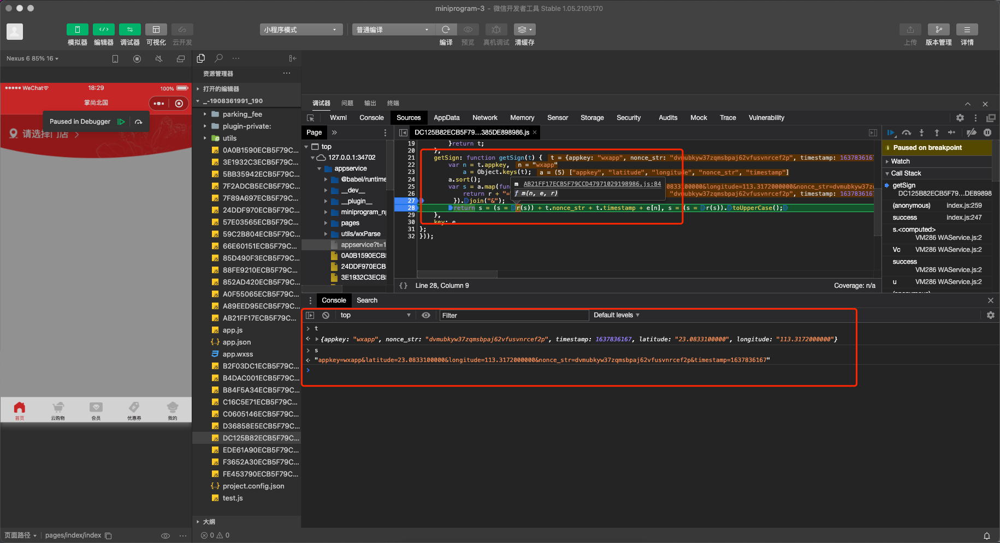

** 2.7 直接在控制台 r(s)进行加密，由于其他地方用到了md5，所以先尝试一下md5是否值一样; 然后可以发现值是相等的，所以可以判断r 是Md5方法; 然后根据javascript的代码，进行Python的模拟 **
```python
from hashlib import md5

s = "appkey=wxapp&latitude=23.0833100000&longitude=113.3172000000&nonce_str=pr8ac2eo1f8jd7e8bpczboge5b5lyfys&timestamp=1637836560"
sign = '24b1f78c6771a1563d66cdb4bfd048fb'

print(md5(s.encode()).hexdigest() == sign)
```
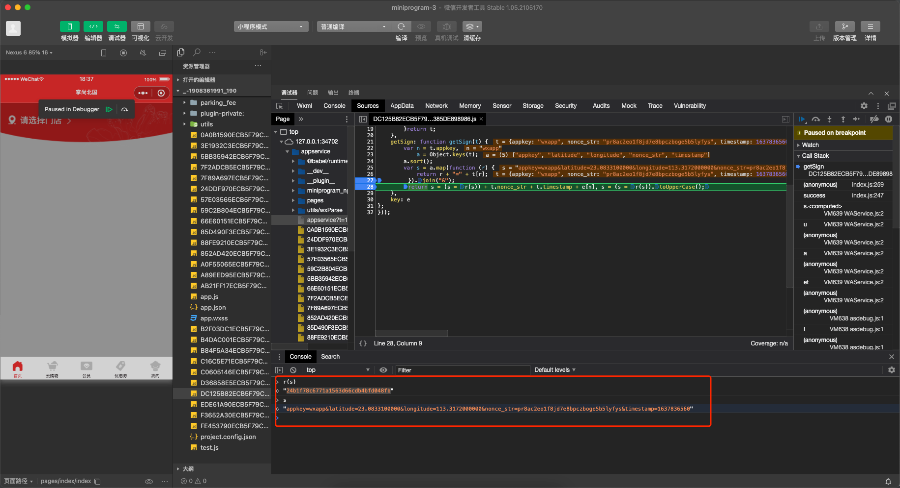